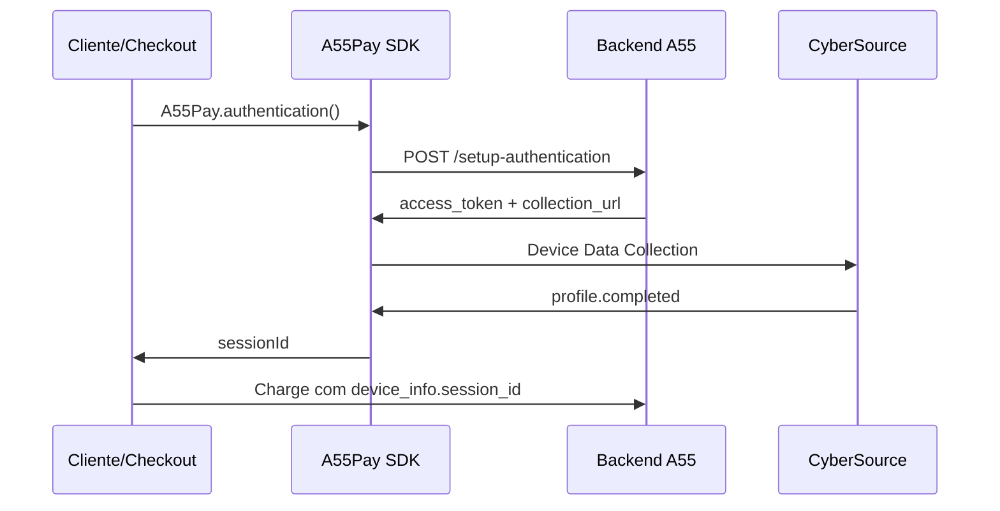

# A55Pay SDK - Funcionalidade de Autenticação 3DS

## 📋 Visão Geral

A funcionalidade `A55Pay.authentication` implementa o **Device Data Collection** da CyberSource/Cardinal Commerce para melhorar significativamente as taxas de aprovação na autenticação 3D Secure (3DS). 

Este script executa a coleta de dados do dispositivo do usuário em background, seguindo exatamente a documentação oficial da CyberSource, garantindo que todas as informações necessárias sejam coletadas antes do processo de autenticação.

## 🎯 Benefícios

- ✅ **Melhora taxas de aprovação 3DS**: Coleta dados cruciais do dispositivo
- ✅ **Implementação oficial**: Segue 100% a documentação da CyberSource
- ✅ **Integração simples**: Uma única função no SDK
- ✅ **Background processing**: Invisível para o usuário final
- ✅ **Session ID pronto**: Retorna SessionId para uso imediato

## 🚀 Como Funciona

### Fluxo de Integração:



### 1. Cliente chama o SDK no checkout
No momento que o usuário clica em "Pagar", antes de processar o pagamento:

```javascript
A55Pay.authentication({
  transactionReference: "uuid-da-transacao",
  cardBrand: "Visa",
  cardExpiryMonth: "08", 
  cardExpiryYear: "2029",
  cardNumber: "<CARD_NUMBER>",
  onSuccess: function(result) {
    // Device Data Collection completado
    const sessionId = result.sessionId;
    // Usar sessionId no próximo passo
  },
  onError: function(error) {
    console.error('Erro na autenticação:', error);
  }
});
```

### 2. Usar SessionId na requisição de charge
Após obter o `sessionId`, incluí-lo na requisição de pagamento:

```javascript
// Exemplo de payload para charge
const chargePayload = {
  // ... outros dados do pagamento
  device_info: {
    session_id: sessionId  // SessionId obtido do Device Data Collection
  }
  // ... resto do payload
};
```

## 📝 Documentação da API

### A55Pay.authentication(config)

Executa o Device Data Collection da CyberSource para melhorar aprovação 3DS.

#### Parâmetros do config:

| Parâmetro | Tipo | Obrigatório | Descrição |
|-----------|------|-------------|-----------|
| `transactionReference` | String | Sim | UUID único da transação |
| `cardBrand` | String | Sim | Bandeira do cartão (ver lista abaixo) |
| `cardExpiryMonth` | String | Sim | Mês de expiração (formato: "08") |
| `cardExpiryYear` | String | Sim | Ano de expiração (formato: "2029") |
| `cardNumber` | String | Sim | Número do cartão sem espaços |
| `onSuccess` | Function | Sim | Callback de sucesso |
| `onError` | Function | Sim | Callback de erro |

#### Bandeiras suportadas:
- `Visa`
- `MasterCard` 
- `AmericanExpress`
- `Discover`
- `JCB`
- `DinersClub`
- `Hipercard`
- `Elo`

#### Retorno onSuccess:

```javascript
{
  sessionId: "<SESSION_ID>",
  accessToken: "<JWT>",
  referenceId: "<REFERENCE_ID>",
  deviceDataCollection: "completed"
}
```

## 💻 Exemplo Completo de Implementação

### HTML/JavaScript do Checkout:

```html
<!DOCTYPE html>
<html>
<head>
    <title>Checkout com Autenticação 3DS</title>
</head>
<body>
    <button id="payButton">Pagar</button>
    
    <!-- A55Pay SDK -->
    <script src="https://cdn.a55.tech/sdk/a55pay-sdk.js"></script>
    
    <script>
        document.getElementById('payButton').addEventListener('click', function() {
            // 1. Executar Device Data Collection
            A55Pay.authentication({
                transactionReference: "<TRANSACTION_REFERENCE>",
                cardBrand: "Visa",
                cardExpiryMonth: "08",
                cardExpiryYear: "2029", 
                cardNumber: "<CARD_NUMBER>",
                
                onSuccess: function(result) {
                    console.log('Device Data Collection completo');
                    
                    // 2. Processar pagamento com sessionId
                    processPayment(result.sessionId);
                },
                
                onError: function(error) {
                    console.error('Erro no Device Data Collection:', error);
                    // Tratar erro ou prosseguir sem Device Data Collection
                }
            });
        });
        
        function processPayment(sessionId) {
            // 3. Enviar dados de pagamento incluindo sessionId
            fetch('/api/charge', {
                method: 'POST',
                headers: { 'Content-Type': 'application/json' },
                body: JSON.stringify({
                    // ... dados do cartão e pagamento
                    device_info: {
                        session_id: sessionId  // SessionId do Device Data Collection
                    }
                })
            })
            .then(response => response.json())
            .then(data => {
                console.log('Pagamento processado:', data);
                // Tratar resposta do pagamento
            });
        }
    </script>
</body>
</html>
```

## 🔧 Configuração Backend

### Endpoint necessário:
```
POST https://core-manager.a55.tech/api/v1/bank/public/setup-authentication
```

### Payload de entrada:
```json
{
  "transaction_reference": "<TRANSACTION_REFERENCE>",
  "card_brand": "Visa",
  "card_expiry_month": "08",
  "card_expiry_year": "2029",
  "card_number": "<CARD_NUMBER>"
}
```

### Resposta esperada:
```json
{
  "access_token": "<JWT>",
  "reference_id": "71865b52-53a1-4cc3-a0ad-beab2d9b50e5",
  "device_data_collection_url": "https://centinelapistag.cardinalcommerce.com/V1/Cruise/Collect"
}
```

## 🔍 Detalhes Técnicos

### Implementação Device Data Collection

A funcionalidade segue exatamente a documentação oficial da CyberSource:

1. **Iframe Oculto**: Cria iframe invisível com ID `ddc-iframe`
2. **Formulário POST**: Submete JWT via POST para URL da CyberSource
3. **Message Listener**: Escuta evento `profile.completed` 
4. **Cleanup**: Remove elementos após conclusão

### Estrutura HTML gerada:

```html
<iframe id="ddc-iframe" name="ddc-iframe" height="1" width="1" style="display: none;"></iframe>

<form id="ddc-form" target="ddc-iframe" method="POST" action="https://centinelapistag.cardinalcommerce.com/V1/Cruise/Collect">
    <input type="hidden" name="JWT" value="<JWT>">
</form>
```

### Message Handler:

```javascript
function messageHandler(event) {
  if (event.origin === 'https://centinelapistag.cardinalcommerce.com') {
    let data = JSON.parse(event.data);
    
    if (data.MessageType === 'profile.completed') {
      // Device Data Collection completado
      console.log('SongBird ran DF successfully');
    }
  }
}
```

## ⚠️ Considerações Importantes

### Timeouts e Fallbacks:
- **Timeout**: 30 segundos de timeout de segurança
- **Fallback**: Retorna sucesso mesmo com timeout (coleta pode ter funcionado)
- **Cleanup**: Remove automaticamente iframe e formulário

### Segurança:
- **Origin Validation**: Aceita apenas mensagens de `centinelapistag.cardinalcommerce.com`
- **JWT**: Access token seguro fornecido pelo backend
- **HTTPS**: Todas as comunicações via HTTPS

### Performance:
- **Invisível**: Processo completamente transparente ao usuário
- **Assíncrono**: Não bloqueia interface do usuário
- **Rápido**: Geralmente completa em 2-3 segundos

## 🚨 Troubleshooting

### Problemas Comuns:

1. **Timeout na coleta**:
   - Verificar conectividade de rede
   - Confirmar se URL da CyberSource está acessível

2. **Erro de CORS**:
   - Verificar se domínio está cadastrado na CyberSource
   - Confirmar configurações de CORS no backend

3. **JWT inválido**:
   - Verificar se access_token está sendo gerado corretamente
   - Confirmar configurações da CyberSource no backend

### Debug:

```javascript
// Habilitar logs detalhados
A55Pay.authentication({
  // ... configurações
  onSuccess: function(result) {
    console.log('Device Data Collection Success:', result);
    // Verificar se sessionId está presente
  },
  onError: function(error) {
    console.error('Device Data Collection Error:', error);
    // Analisar tipo de erro
  }
});
```

## 📊 Monitoramento

### Métricas Importantes:
- Taxa de sucesso do Device Data Collection
- Tempo médio de coleta
- Taxa de aprovação 3DS antes/depois da implementação

### Logs recomendados:
```javascript
// Log início da coleta
console.log('Starting Device Data Collection for transaction:', transactionReference);

// Log conclusão
console.log('Device Data Collection completed, SessionId:', sessionId);

// Log uso no pagamento  
console.log('Using SessionId in payment:', sessionId);
```

## 🔄 Versionamento

**Versão atual**: 1.0.0

### Changelog:
- **1.0.0**: Implementação inicial seguindo documentação oficial CyberSource

## 📞 Suporte

Para dúvidas ou problemas com a implementação:
- Documentação: [A55Pay Docs](https://docs.a55.tech)
- Suporte técnico: suporte@a55.tech

---

**Importante**: Esta funcionalidade deve ser implementada **antes** de qualquer tentativa de autenticação 3DS para garantir as melhores taxas de aprovação possíveis.
